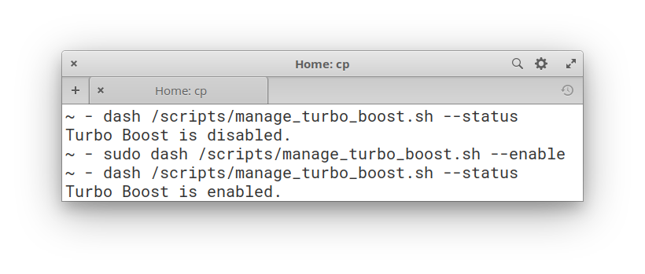

# manage_turbo_boost.sh

**WARNING! IT MAY DAMAGE YOUR HARDWARE. USE AT YOUR OWN RISK.**

A small script written for POSIX-compatible shells. *(Tested with Bash and Dash)*

This tool allows you to manage Intel's Turbo Boost technology - enable/disable it, if there's no such option in your BIOS or UEFI, or show its current status. It may be handy if you play video games on Linux and experience freezes and/or stuttering, which most of the time is true for laptops.

- [Usage](#usage)
- [Example usage on the command line](#example)
- [Tips](#tips)
- [License](#license)

## Usage
There are four possible flags you can pass to the *manage_turbo_boost.sh* script:
- `--help` - show help message.
- `--status` - show current status of the Turbo Boost.
- `--enable` - enable Turbo Boost.
- `--disable` - disable Turbo Boost.

In order to use this script, you need:
1. Place it in an accessible place. e. g. */scripts*

2. Make it executable:
`chmod a+x ./manage_turbo_boost.sh`.

3. Allow writing changes to the **"no_turbo"** file:
`sudo chmod a+w /sys/devices/system/cpu/intel_pstate/no_turbo`.

4. Run it by specifying a shell:
For example, `dash manage_turbo_boost.sh` *--some-argument*

**NOTE: `--enable` and `--disable` flags require root priveleges!**

## Example

## Tips
- If most of your games have performance issues due to the enabled Turbo Boost, you may find it useful to execute this script during system reboot.
As an example: All games on my system except NFS Payback work poorly with the Turbo Boost, so I have added the script to cron jobs for the root user. It is achieved by using crontab:
Type `sudo crontab -e` in your shell
and then add something like this to the file that will be opened: `@reboot <SHELL> /scripts/manage_turbo_boost.sh --disable > /home/<USER>/.txt/logs/dtb.log 2> /home/<USER>/.txt/logs/dtb.err`, where *\<USER\>* is your username and *\<SHELL\>* is your shell. This line runs the script as root at the boot time and then redirects output from STDOUT and STDERR to the appropriate log files.

## License
Licensed under the [BSD Zero Clause License](./LICENSE) and provided without any warranty.
